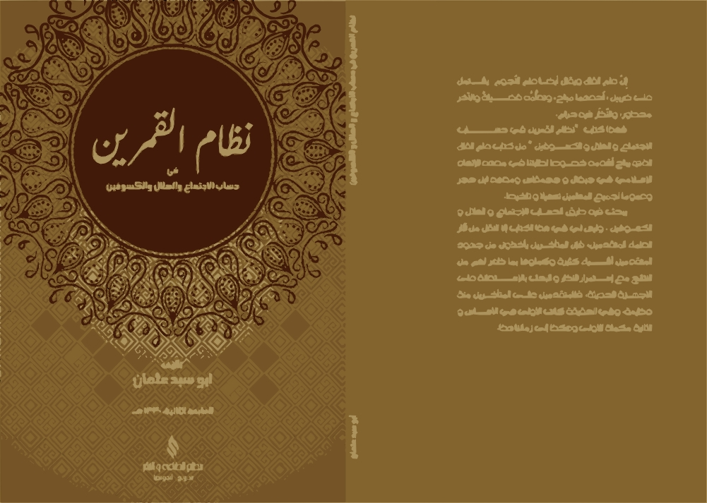

<p align="center">
  
</p>

<h2 align="center"><b>Nizhamul Qomaroin</b></h2>
<p align="center">
<b>Library Hisab metode Kitab Nizhamul Qomaroin</b>
<p><br>

<p align="center">
<!-- Latest release -->

<!-- Jitpack release -->

<!-- Github Repo size -->

<!-- Build with Kotlin -->

<!-- License -->

</p>

# Tentang Kitab Nizhamul Qomaroin
Kitab ini merupakan karya dari [Ust Abu Sabda](https://github.com/abusabda) Bandung, yang membahas cara menghitung Ijtima', posisi Hilal untuk awal bulan Hijriyah, Gerhana Matahari & Bulan. Jika disandingkan dengan hasil hitung NASA selisihnya hanya beberapa detik.

# Dokumentasi penggunaan
- [Dokumentasi](https://hasanelfalakiy.github.io/lib-nizhamul-qomaroin/docs/index.html)

## Fitur

- [x] Gerhana Bulan (Elemen bessel diinput manual)
- [x] Gerhana Matahari (Elemen bessel diinput manual)
- [ ] Hisab Awal Bulan Hijriyah

## Persyaratan

- Mempunyai kitab Nizhamul Qomaroin, karena data input diperoleh dari tabel harokat kusuf & khusuf (Elemen bessel) yang ada di kitab Nizhamul Qomaroin.

## Konfigurasi pertama

1. Masukkan kode ini ke settings.gradle.kts (root kotlin dsl) di blok ```repositories```
```kotlin.kts
  dependencyResolutionManagement {
    repositories {
      // contoh
      maven {
        url = uri("https://jitpack.io")
      }
    }
  }
```
Jika menggunakan groovy dsl
```groovy
  repositories {
    ...
    maven { url 'https://jitpack.io' }
  }
```
2. Masukkan dependensi ke build.gradle.kts (app/build.gradle.kts kotlin dsl)
di blok ```dependencies``` 

```kotlin.kts
implementation("com.github.hasanelfalakiy:lib-nizhamul-qomaroin:1.0.0")
```
jika menggunakan groovy dsl
```groovy
implementation 'com.github.hasanelfalakiy:lib-nizhamul-qomaroin:1.0.0'
```
## Ingin berkontribusi?

> Jika Anda ingin berkontribusi, silahkan menggarpu (Fork) repositori ini, buat perubahan, kirim Pull request ke repositori ini

## Kontak Kami

- [Telegram](https://t.me/moonelfalakiy)
- [Grup diskusi Telegram](https://t.me/moonlight_studio01/9)

## License

This project is released under the [GPL-3 License](./LICENSE).
