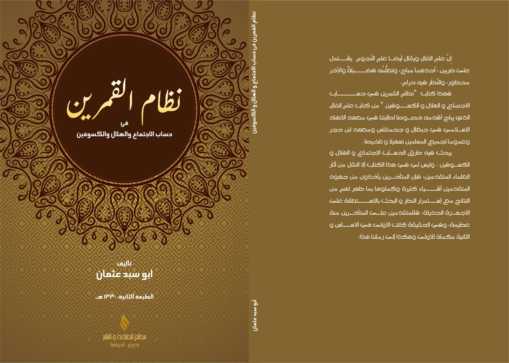

<!DOCTYPE html>
<html lang="en">
<head>
  <meta charset="UTF-8">
  <title>Nizhamul Qomaroin</title>
  <link href="https://cdnjs.cloudflare.com/ajax/libs/prism/1.24.1/themes/prism.min.css" rel="stylesheet"/>
  
  
  
</head>
<body>

  

<h2 align="center"><b>Nizhamul Qomaroin</b></h2>

<b>Library Hisab metode Kitab Nizhamul Qomaroin</b>

 

<!-- Latest release -->

<!-- Jitpack release -->

<!-- Github Repo size -->

<!-- Build with Kotlin -->

<!-- License -->

<h1>Tentang Kitab Nihzamul Qomaroin</h1>

Kitab ini merupakan karya dari Ust Abu Sabda Bandung, yang membahas cara menghitung Ijtima', posisi Hilal untuk awal bulan Hijriyah, Gerhana Matahari & Bulan. Jika disandingkan dengan hasil hitung NASA selisihnya hanya beberapa detik.

<h1>Dokumentasi penggunaan</h1>
<ul>
    <li><a href="https://hasanelfalakiy.github.io/lib-nizhamul-qomaroin/docs/index.html/">Dokumentasi</a></li>
</ul>

<h2>Fitur</h2>
<ul>
    <li>[x] Gerhana Bulan</li>
    <li>[x] Gerhana Matahari</li>
    <li>[ ] Hisab Awal Bulan Hijriyah</li>
</ul>

<h2>Konfigurasi pertama</h2>
<ol>
    <li>masukkan kode ini ke settings.gradle.kts (root kotlin dsl) di blok <code>repositories</code>
        <pre><code class="language-kotlin">
        dependencyResolutionManagement {
            repositories {
                // contoh
                maven {
                    url = uri("https://jitpack.io")
                }
            }
        }
        </code></pre>
        jika menggunakan groovy dsl
        <pre><code class="language-groovy">
        repositories {
            ...
            maven { url 'https://jitpack.io' }
        }
        </code></pre>
    </li>
    <li>masukkan dependensi ke build.gradle.kts (app/build.gradle.kts kotlin dsl) di blok <code>dependencies</code>
        <pre><code class="language-kotlin">
        implementation("com.github.hasanelfalakiy:lib-nizhamul-qomaroin:1.0.0")
        </code></pre>
        jika menggunakan groovy dsl
        <pre><code class="language-groovy">
        implementation 'com.github.hasanelfalakiy:lib-nizhamul-qomaroin:1.0.0'
        </code></pre>
    </li>
</ol>

<h2>Ingin berkontribusi?</h2>
<blockquote>Jika Anda ingin berkontribusi, silahkan menggarpu (Fork) repositori ini, buat perubahan, kirim Pull request ke repositori ini</blockquote>

<h2>Kontak Kami</h2>
<ul>
    <li><a href="https://t.me/moonelfalakiy">Telegram</a></li>
    <li><a href="https://t.me/moonlight_studio01/9">Grup diskusi Telegram</a></li>
</ul>

<h2>License</h2>

This project is released under the <a href="./LICENSE">GPL-3 License</a>.

</body>
</html>